<div align="center">
  
</div>

<br/>

<div align="center">
  <a href="https://sidhantkumar1315.github.io/portfolioWebsite/">
    
  </a>&nbsp;
  <a href="https://www.linkedin.com/in/sidhant-kumar-90ba65290/">
    
  </a>&nbsp;
  <a href="mailto:sd247182@dal.ca">
    
  </a>&nbsp;
  
</div>

<br/>

---

## `$ cat about.txt`

```text
Name     :  Sidhant Kumar
Degree   :  B.Sc Computer Science (Co-op) — Dalhousie University
Location :  Halifax, Nova Scotia, Canada
Seeking  :  Fall 2026 Software Developer Co-op
Interests:  Real-time systems · AI applications · Full-stack dev
```

---

## `$ ls -la ~/projects/`

```bash
drwxr-xr-x  PeerSync/     Real-time collaborative coding for VS Code
drwxr-xr-x  VoicetoSQL/   Natural language → SQL with Llama 3.3
drwxr-xr-x  Groki/        Voice-controlled AI inventory manager
```

<div align="center">

| Project | Stack | Link |
|---------|-------|:----:|
| **PeerSync** | TypeScript · Node.js · WebSocket | [→ VS Code Marketplace](https://marketplace.visualstudio.com/items?itemName=peersync.peersync) |
| **VoicetoSQL** | React · FastAPI · Llama 3.3 · Groq | [→ Live](https://voiceto-sql.vercel.app/) |
| **Groki** | Next.js · Node.js · OpenAI | [→ Live](https://groki-app-final.vercel.app/) |

</div>

---

## `$ cat tech-stack.txt`

**Languages**


**Frontend**


**Backend**


**Databases & Cloud**


**AI**


---

## `$ git log --graph --oneline`

<div align="center">
  <picture>
    <source media="(prefers-color-scheme: dark)" srcset="https://raw.githubusercontent.com/sidhantkumar1315/sidhantkumar1315/output/github-contribution-grid-snake-dark.svg">
    <source media="(prefers-color-scheme: light)" srcset="https://raw.githubusercontent.com/sidhantkumar1315/sidhantkumar1315/output/github-contribution-grid-snake.svg">
    
  </picture>
</div>

---

<div align="center">
  <_-Thanks%20for%20visiting-00FF41?style=flat-square&labelColor=000000"/>
</div>
